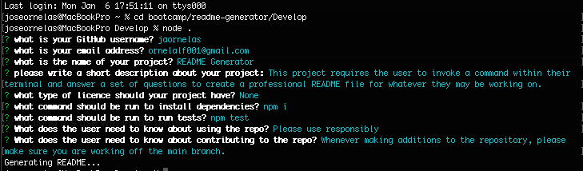

# Node.js Challenge: Professional README Generator

## Description

When creating an open source project on GitHub, it’s important to have a high-quality README for the app. This should include what the app is for, how to use the app, how to install it, how to report issues, and how to make contributions&mdash;this last part increases the likelihood that other developers will contribute to the success of the project. 

In this challenge, you'll be able to quickly and easily create a README file by using a command-line application to generate one. This allows the project creator to devote more time to working on the project.

Your task is to create a command-line application that dynamically generates a professional README.md file from a user's input using the [Inquirer package](https://www.npmjs.com/package/inquirer). 

The application will be invoked by using the following command:

```bash
node index.js
```

## Technologies Used   
* JavaScript
* Node.js

These technologies were used primarily as a tool to implement the node runtime and excercising it's use within the terminal. 

## Instructions
After the command provided above is invoked, the terminal will prompt the user a set of questions about their project to generate a professional README. 



## Links to host link and repository. 
* [Video](https://drive.google.com/file/d/1yVovA5ezHgY-zH31r8AiG0QlYG_sbbLv/view)
* [GitHub Repository](https://github.com/jaornelas/readme-generator)
